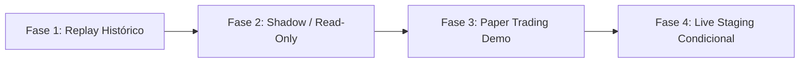

# Blueprint de Integración de Bridge en Tiempo Real (Exness / MT5 / ProjectX)

## 1. Declaración de Seguridad y Restricciones Operativas

> [!IMPORTANT]
> **ESTADO: ARQUITECTURA TEÓRICA Y DE REPLAY HISTÓRICO (FASE PRE-CONEXIÓN)**
> - **Sin conexión a brokers**: No se realiza conexión de red, socket ni IPC con ningún broker (Exness, MetaQuotes, NinjaTrader, etc.).
> - **Sin credenciales**: El sistema no solicita, almacena, lee ni expone credenciales (cuentas, contraseñas, tokens de API o claves de servidor).
> - **Sin órdenes reales**: Queda terminantemente prohibido el envío de órdenes de mercado, órdenes pendientes o cancelaciones hacia infraestructura real de ejecución en esta fase.
> - **Aislamiento verificado**: Toda la validación en tiempo real se ejecuta mediante `ReplayEngine` con `FrozenClock` y eventos canónicos reproducidos localmente desde archivos inmutables.

---

## 2. Arquitectura del Módulo Realtime en FARS

El subsistema de tiempo real de FARS (`src/realtime/`) está desacoplado del origen de los datos mediante una arquitectura de bus de eventos asíncrono basada en tipos canónicos congelados (`dataclass(frozen=True)`).

```mermaid
flowchart TD
    subgraph DataSources [Fuentes de Datos]
        A1[Replay Histórico: FileEventRecorder] -->|ReplayEngine + FrozenClock| B[AsyncIOEventBus]
        A2[MT5 / Exness Read-Only Bridge] -.->|Fase Futura: Socket/IPC| B
    end

    subgraph CoreRealtimeBus [Bus de Eventos Canónico]
        B -->|Bar / MarketTick| C[SmcFvgStrategy / EmasStrategy]
        C -->|Signal (LONG/SHORT)| D[RiskEngine Fail-Closed]
        D -->|Approved: RiskDecision| E[ExecutionGateway]
        D -->|Rejected: Reason| F[Journal / Audit Log]
    end

    subgraph ExecutionLayer [Capa de Ejecución Segura]
        E -->|Modo 1: Replay| G[PaperSimulator / Virtual Fill]
        E -->|Modo 2: Shadow/Dry-Run| H[Log de Órdenes Sin Conexión]
        E -.->|Modo 3: Live Gate Bloqueado| I[Broker Gateway REQUIERE AUTORIZACIÓN]
    end
```

### Componentes Principales

1. **`AsyncIOEventBus` (`src/realtime/bus.py`)**:
   - Cola asíncrona no bloqueante con control de contrapresión (`maxsize`).
   - Política estricta de ordenación causal y suscripciones deterministas.
   - Compatibilidad total entre sesiones en vivo (`ORIGIN_LIVE = "live"`) y sesiones de repetición (`ORIGIN_REPLAY = "replay"`).

2. **Tipos de Eventos Canónicos (`src/realtime/events.py`)**:
   - `Bar`: Intervalo OHLCV con validación de envolvente, marca temporal con zona horaria UTC explícita y coherencia $high \ge low$, $high \ge open, close$.
   - `MarketTick` / `Quote`: Precios de mercado individuales para cálculo intrabarra.
   - `Signal`: Propuesta emitida por la estrategia. No constituye autorización de ejecución.
   - `RiskDecision`: Decisión obligatoria del motor de riesgo (`approved: bool`, `reason: str`). Política **fail-closed**: la ausencia de decisión o cualquier valor no explícito equivale a rechazo.

3. **`ReplayEngine` y `FrozenClock` (`src/realtime/replay.py`, `src/realtime/clock.py`)**:
   - Garantizan que el tiempo del sistema avanza de forma determinista barra a barra.
   - La estrategia se ejecuta exactamente con la misma interfaz que en vivo, sin conocer si los datos provienen de un feed en tiempo real o de un replay histórico.

---

## 3. Protocolo de Integración para MetaTrader 5 / Exness

Cuando se configure la infraestructura de MT5 / Exness, la integración debe seguir estrictamente las siguientes cuatro fases:



### Fase 1: Replay Histórico (Completada y Verificada)
- **Objetivo**: Demostrar que el pipeline emite señales causales basadas exclusivamente en barras cerradas.
- **Resultado en FARS**: Verificado al 100% en `lab_artifacts/CODEX_OMNIROUTE_RUN/realtime_replay_verification.json` (2,000 barras analizadas, 20 señales idénticas bit a bit con el backtest causal, 0 violaciones temporales).

### Fase 2: Shadow / Read-Only (Próximo Hito)
- **Objetivo**: Conectar el feed de datos de MT5 en modo estrictamente de sólo lectura.
- **Implementación**:
  - Un conector ligero en Python utilizando la API oficial de MetaTrader 5 (`MetaTrader5.initialize()`, `copy_rates_from_pos`).
  - La conexión sólo invoca métodos de lectura (`copy_rates_*`, `symbol_info_tick`).
  - Cada barra cerrada de M5 es convertida a un evento canónico `src.realtime.events.Bar` y publicada en el `AsyncIOEventBus`.
  - Las señales generadas y las decisiones de riesgo se registran en un journal JSONL sin enviar ninguna solicitud de orden (`order_send` queda inhabilitado a nivel de interfaz).

### Fase 3: Paper Trading / Demo Account
- **Objetivo**: Medir latencias de red, slippage real del broker y costes de spread/comisión en cuenta demo.
- **Implementación**:
  - Enrutamiento de órdenes hacia cuenta demo de Exness.
  - Verificación de reconciliación de balances y posiciones mediante `AccountSnapshot`.
  - Comprobación de que la política de contratos discretos (`discrete_partial_contracts`) se ejecuta correctamente en el broker (órdenes de tamaño entero $1, 2, \dots$ sin contratos fraccionarios no soportados).

### Fase 4: Live Staging Condicional (Producción)
- **Objetivo**: Ejecución real con capital controlado.
- **Requisitos previos bloqueantes**:
  1. Aprobación explícita del operador humano.
  2. Implementación de Circuit Breaker de pérdidas diarias en `src/realtime/risk.py`.
  3. Aislamiento estricto de credenciales mediante variables de entorno en bóveda segura (`.env` o gestor de secretos, nunca en repositorios Git ni logs).
  4. Conciliación periódica obligatoria de posiciones abiertas entre el estado del broker y el estado interno del motor.

---

## 4. Especificación Técnica de la Interfaz del Conector MT5

```python
from dataclasses import dataclass
from datetime import UTC, datetime
from typing import Protocol
from src.realtime.events import Bar, ORIGIN_LIVE

class MT5DataFeed(Protocol):
    """Interfaz abstracta de solo lectura para el feed de MetaTrader 5."""
    
    def connect_feed(self) -> bool:
        """Inicializa la sesión de lectura sin privilegios de trading."""
        ...
        
    def poll_closed_bar(self, symbol: str, timeframe: str) -> Bar | None:
        """Devuelve una nueva barra cerrada verificada o None si la barra actual sigue abierta."""
        ...
        
    def disconnect_feed(self) -> None:
        """Cierra la conexión con el terminal de forma limpia."""
        ...
```

### Reglas de Invarianza para Barras Cerradas en MT5
1. **Verificación de cierre**: Una barra de MT5 sólo es procesada cuando `current_broker_time >= bar_open_time + bar_interval_seconds`.
2. **Congelación de volumen y precios**: Los valores `open`, `high`, `low`, `close` y `volume` de la barra no deben mutar una vez aceptados.
3. **Mapeo de símbolos**: Normalización explícita entre nombres de símbolos del broker (ej. `USTEC`, `US100`, `NQ_m`) y el identificador canónico de FARS (`MNQ`).
